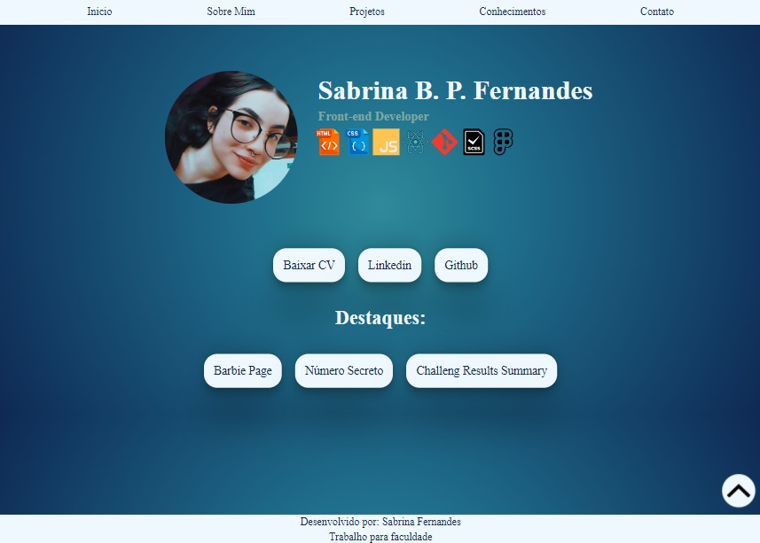
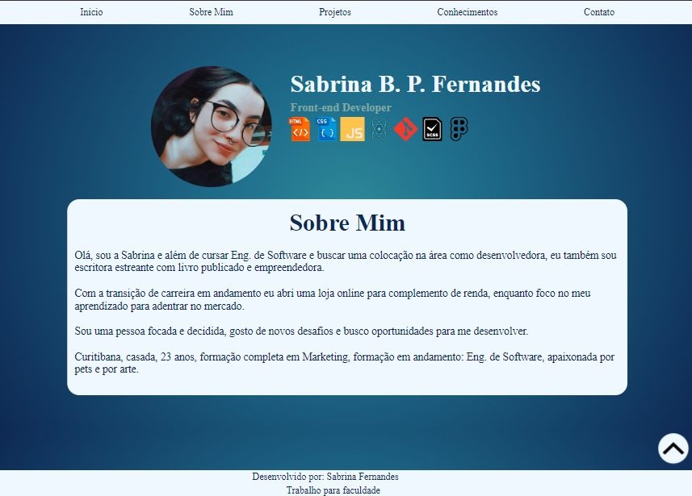
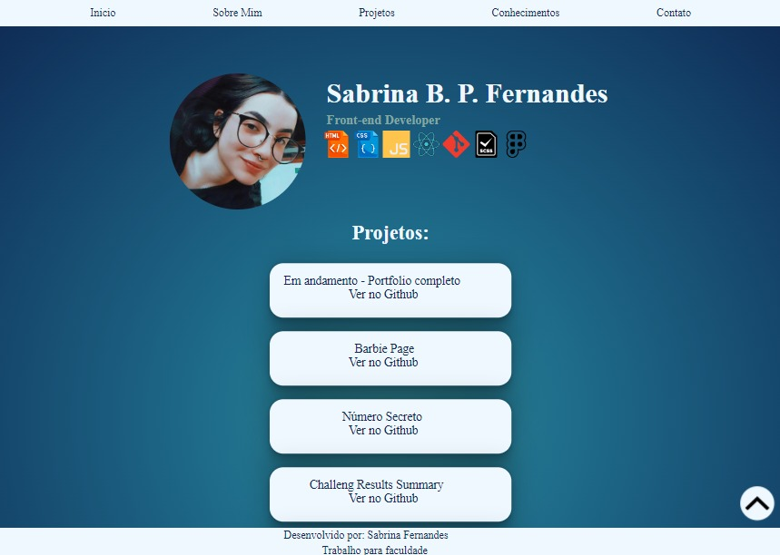
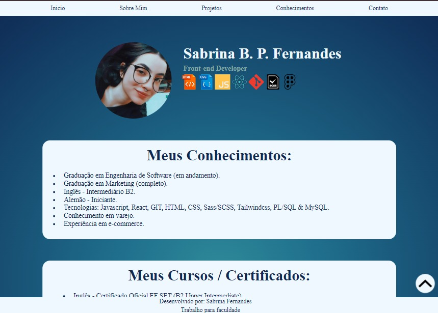
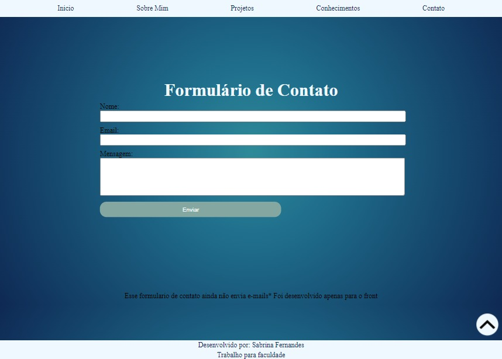

## Portfólio criado mediante proposta de trabalho da faculdade de Eng. de Software. 

Matéria: Aplicações Web e Móveis

### Tecnologias Utilizadas: 

- HTML
- CSS
- JavaScript

Observação: Design Responsivo

### Página Inicial

- Links
- CV
- Projetos em destaque

### Página Sobre Mim

- Apresentação
- Resumo Profissional

### Projetos

- Listagem de projetos desenvolvidos/ links para os mesmos

### Conhecimentos

- Meus conhecimentos / Formação
- Meus cursos e certificados

### Contato 

- Formulário de contato (apenas frontend)

